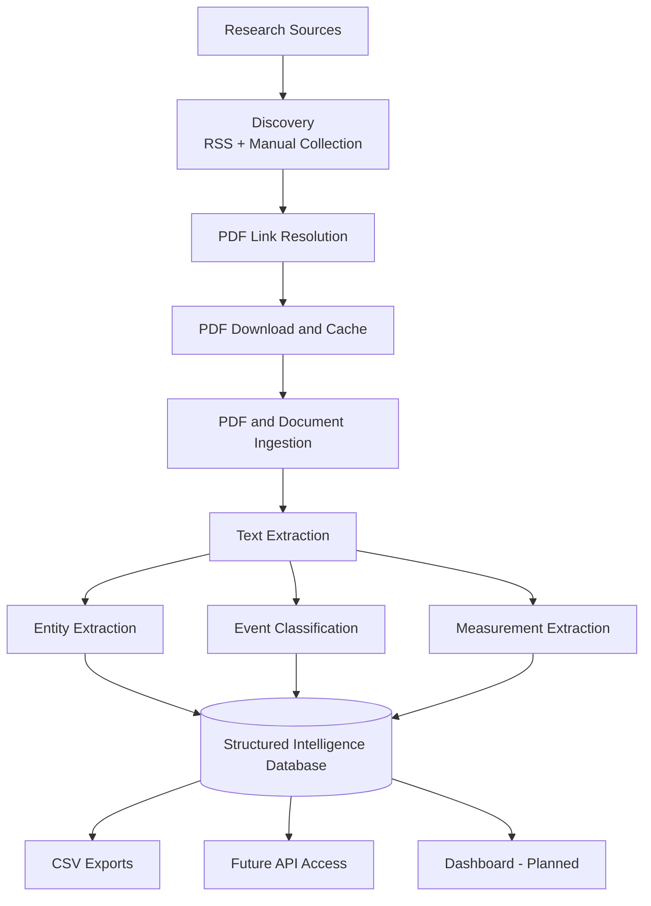
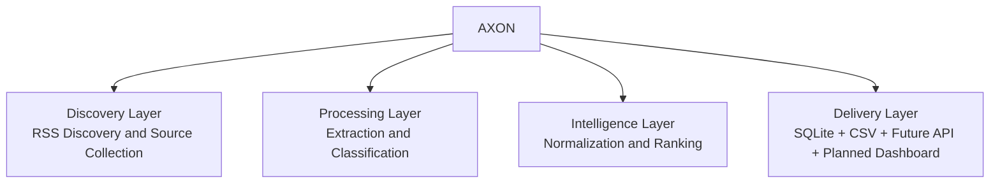

# AXON Research Intelligence Engine

A modular research intelligence platform that discovers, ingests, analyzes, and structures knowledge from scientific literature, technical reports, and research documents across multiple domains.

AXON transforms PDFs, research papers, and curated content sources into structured intelligence that can be searched, analyzed, exported, and visualized.

Built for researchers, engineers, analysts, and technical teams who need more than document storage and keyword search.

[](https://www.python.org/downloads/)
[](https://opensource.org/licenses/MIT)
[](https://github.com/Magikmikedaboss/labscraper)

---

## 🎯 What It Does

AXON converts unstructured research content into structured knowledge.

### Input Sources

- Scientific PDFs
- Technical reports
- White papers
- Research archives
- RSS feeds
- Domain-specific document collections

### Processing Pipeline



### Outputs

AXON produces:

- Research events
- Scientific entities
- Quantitative measurements
- Entity relationships
- Source metadata
- Domain insights
- Structured databases
- Exportable analytics

## 🚀 Core Capabilities

### Document Intelligence

Extracts information from:

- Research papers
- Technical publications
- Engineering studies
- Scientific reports
- Domain-specific PDF libraries

### Entity Extraction

Identifies and normalizes:

- Compounds
- Targets
- Assays
- Pathways
- Models
- Indications
- Materials
- Methods
- Stem cells
- Domain-specific entities

Entity definitions are driven by configurable seed files and overlays.

### Event Extraction

Detects meaningful research events including:

- Positive outcomes
- Negative outcomes
- Stability issues
- Failure modes
- Performance improvements
- Decision points
- Regulatory concerns
- Validation findings

### Quantitative Extraction

Captures measurable data such as:

- IC50
- EC50
- Ki
- Kd
- Half-life
- Strength values
- Environmental metrics
- Performance measurements
- Experimental results

### Relationship Detection

The data model supports entity relationships via `entity_relationships`.
Automated relationship extraction exists in utility modules and is still being hardened for broad production use.

### Multi-Domain Architecture

AXON supports multiple research domains using configurable overlays.

Current configured domains include:

- Biohacking & Longevity
- Construction Science
- Drug Discovery
- Methods & Tooling
- Neuroscience & Cognition
- Stem Cells & Regeneration

Additional domains can be added without modifying the core engine.

## 🏗 System Architecture



## 📂 Project Goals

AXON is being developed as a research intelligence platform rather than a traditional document archive.

The long-term objective is to help teams answer questions such as:

- What compounds are showing consistent positive outcomes?
- Which methods appear most frequently in successful studies?
- What failure patterns emerge across thousands of papers?
- What trends are accelerating within a specific domain?
- Which findings deserve deeper investigation?

Instead of storing documents, AXON extracts knowledge.

## 🛣 Roadmap

### Phase 1: Research Engine

- PDF ingestion
- Entity extraction
- Event extraction
- Measurement extraction
- SQLite storage
- CSV exports
- Parallel processing

### Phase 2: Source Intelligence

- RSS discovery
- Automated PDF acquisition
- Expanded source metadata capture
- Cross-source deduplication
- Run history and provenance views

### Phase 3: Knowledge Platform

- REST API
- Search interface
- Entity explorer
- Relationship visualization
- Dashboard

### Phase 4: Intelligence Layer

- AI-powered summaries
- Trend detection
- Cross-paper insights
- Research recommendations
- Knowledge graph generation

## 📌 Current Status

**Status:** Active Development

AXON currently functions as a production-capable research extraction engine with multi-domain PDF analysis, structured intelligence extraction, RSS discovery, and export pipelines.

Development is focused on source intelligence, metadata tracking, dashboard infrastructure, and advanced knowledge discovery features.

## Current State (Implemented)

Today AXON primarily processes PDF research documents.

Current workflow:

1. Discover candidate documents through RSS and manual collection
2. Resolve direct PDF links when available
3. Download/store PDFs locally and ingest text
4. Extract entities, events, and measurements
5. Persist results to SQLite (`db/runs.sqlite` or `db/rss.sqlite`)
6. Export structured outputs to CSV

Note: RSS is used for discovery. PDFs remain the primary intelligence source when available.

---

## 📦 Dependency Management

```bash
# Clone the repository
git clone https://github.com/Magikmikedaboss/labscraper.git
cd labscraper

# Create virtual environment
python -m venv .venv
# Windows PowerShell
.\.venv\Scripts\Activate.ps1

# Install dependencies
pip install -r requirements.txt
```

- **requirements.txt**: List direct dependencies with loose version constraints. Edit this file to add or update packages.
- **requirements-lock.txt**: Fully pinned, auto-generated manifest for reproducible installs. Always use this file for CI, production, or sharing exact environments.
- **How to update**: After editing requirements.txt, run:
  ```bash
  pip install -r requirements.txt
  pip freeze > requirements-lock.txt
  ```
  Commit both files if dependencies change.

## Initialize database

The engine auto-initializes the canonical production/dev database at `db/runs.sqlite` on first run.

For manual or isolated local/CI testing, use the explicit initializer with a non-canonical target path:

```bash
python utils/init_db.py db/local.sqlite
```

Note: `utils/init_db.py` is guarded against direct initialization of the canonical `db/runs.sqlite`.

## Daily Resume (PowerShell)

```powershell
# From repo root
Set-ExecutionPolicy -Scope Process -ExecutionPolicy RemoteSigned
.\.venv\Scripts\Activate.ps1

# Quick health checks
python -m pytest -q
python -m ruff check .
```

## Usage

### Modular Pipeline (Development/Debug)

The modular pipeline is orchestrated by `utils/scrape_pdfs_phase1_full.py`. This script demonstrates the core PDF-to-database logic using only the new modular utility functions, and is ideal for debugging, development, or as a template for further customization.


```bash
# Run the modular pipeline (default input and db paths):
python utils/scrape_pdfs_phase1_full.py
```

#### Basic Processing
```bash
# Single-threaded processing
python utils/run_engine.py --domain construction_science --input-dir input/pdfs/construction_science

# Export results
python utils/export_csv.py --domain construction_science
```

#### Parallel Processing (Recommended for large datasets)
```bash
# 4 parallel workers (recommended)
python utils/scrape_pdfs_parallel.py --domain construction_science --input-dir input/pdfs/construction_science --workers 4

# 8 parallel workers (for powerful systems)
python utils/scrape_pdfs_parallel.py --domain construction_science --input-dir input/pdfs/construction_science --workers 8
```

#### Advanced Analysis
```bash
# Dual-lens analysis (advanced export)
python utils/export/export_dual_lens.py db/runs.sqlite construction_science
```

#### RSS Feed Discovery (Optional)
```bash
# Probe configured feeds and save healthy ones
python tools/test_feeds.py --config config/feeds.json --save-working

# Preview ingest flow without committing records
python run_rss_ingest.py --dry-run
```

#### View Results
```bash
ls exports/
# → candidates_export.csv, events_export.csv, measurements_export.csv, relationships_export.csv
ls db/
# → runs.sqlite (main database)
```

---

## 📂 Project Structure

```
labscraper/
├── utils/                      # Core processing modules
│   ├── scrape_pdfs_parallel.py     # Parallel PDF processing (recommended)
│   ├── run_engine.py               # Single-threaded processing
│   ├── export/                     # Export package
│   │   ├── export_dual_lens.py     # Advanced dual-lens analysis
│   │   ├── aggregation.py          # Overlay/entity aggregation
│   │   ├── normalization.py        # Entity normalization for exports
│   │   └── reporting.py            # Report generation helpers
│   ├── export_csv.py               # Domain-aware CSV export
│   ├── scrape_pdfs_phase1_full.py  # Modular pipeline (development/debug)
│   ├── entities.py                 # Entity extraction utilities
│   ├── event_classification.py     # Event classification logic
│   ├── db_utils.py                 # Database helpers
│   ├── text_utils.py               # Text processing utilities
│   ├── data_extractors.py          # Quantitative data extraction
│   ├── metadata_utils.py           # PDF metadata extraction
│   ├── common.py                   # Common helpers (hashing, etc.)
│   ├── entity_extractor.py         # (legacy) Entity extraction logic
│   ├── entity_normalizer.py        # (legacy) Variant normalization
│   ├── init_db.py                  # Legacy utility module (use root init_db.py to initialize db/runs.sqlite)
│   └── scrape_pdfs_phase1.py       # Base scraper functions
├── schema.sql                  # Database schema
├── config/                     # Configuration files
│   ├── domains/               # Domain-specific configurations
│   └── feeds.json             # RSS feed configurations
├── seeds/                      # Entity seed files
│   ├── base/
│   │   └── life_sciences/     # Canonical location for life-science seed editing
│   │      ├── compounds.txt
│   │      ├── targets.txt
│   │      ├── models.txt
│   │      ├── assays.txt
│   │      ├── indications.json
│   │      ├── pathways.json
│   │      ├── normalization.json
│   │      └── stopwords.txt
│   └── ...                    # Domain and normalization seed assets
├── input/                      # Input directories
│   ├── pdfs/                  # Default PDF input
│   └── pdfs/{domain}/         # Domain-specific PDF input
├── db/                        # Database files
│   ├── runs.sqlite           # Main processing database
│   └── all_pdfs.sqlite       # Combined database
├── exports/                   # Exported data
│   ├── candidates_export.csv # Entity-focused export
│   ├── events_export.csv     # Event export with metadata
│   ├── measurements_export.csv # Quantitative measurements
│   ├── relationships_export.csv # Entity relationships
│   └── latest/               # Latest export with metadata
├── logs/                      # Processing logs
├── output/                    # Legacy output directory
└── requirements.txt           # Python dependencies
```

## 🛠️ Development & Debugging

- To test or extend the modular pipeline, use `utils/scrape_pdfs_phase1_full.py`.
- All core logic is now modularized in `utils/` for easy reuse and testing.
- For production/parallel runs, use `utils/run_engine.py` or `utils/scrape_pdfs_parallel.py`.

---

## 📊 Data Schema

AXON stores source provenance before extraction, then links all extracted intelligence back to source and document records.

### Sources (Provenance)
```sql
sources (
  source_id TEXT PRIMARY KEY,
  title TEXT,
  authors TEXT,
  year INTEGER,
  venue TEXT,
  doi TEXT,
  url TEXT,
  pdf_file TEXT,
  imported_at TEXT
)
```

### Documents (Local Artifacts)
```sql
documents (
  doc_id TEXT PRIMARY KEY,
  source_id TEXT NOT NULL,
  file_path TEXT NOT NULL,
  file_type TEXT NOT NULL,   -- pdf/html/xml
  sha256 TEXT,
  created_at TEXT
)
```

### Chunks (Evidence Units)
```sql
chunks (
  chunk_id TEXT PRIMARY KEY,
  doc_id TEXT NOT NULL,
  source_id TEXT NOT NULL,
  page_number INTEGER,
  section_guess TEXT,
  chunk_text TEXT NOT NULL,
  created_at TEXT
)
```

### Research Events
```sql
research_events (
    event_id TEXT PRIMARY KEY,
    research_domain TEXT,      -- e.g., "peptide"
    event_type TEXT,           -- stability_issue, decision_point, outcome
    study_stage TEXT,          -- in_vitro, in_vivo, clinical
    outcome TEXT,              -- positive, negative, neutral
    decision_driver TEXT,      -- what drove the decision
    evidence_snippet TEXT,     -- supporting text
    confidence TEXT,           -- high, med, low
    source_id TEXT,            -- PDF filename
    created_at TEXT
)
```

### Entities
```sql
entities (
    entity_id TEXT PRIMARY KEY,
    entity_type TEXT,          -- compound, target, assay, pathway, model, indication
    entity_name TEXT,          -- canonical name
    entity_variant TEXT,       -- subtype (e.g., "protein", "cell_line")
    created_at TEXT
)
```

### Event-Entity Links
```sql
event_entities (
    event_id TEXT,
    entity_id TEXT,
    role TEXT,                 -- primary, context
    PRIMARY KEY (event_id, entity_id)
)
```

### Quantitative Measurements
```sql
quantitative_measurements (
  measurement_id TEXT PRIMARY KEY,
  event_id TEXT NOT NULL,
  measurement_type TEXT NOT NULL,
  value TEXT NOT NULL,
  unit TEXT NOT NULL,
  context TEXT,
  created_at TEXT
)
```

### Entity Relationships
```sql
entity_relationships (
  relationship_id TEXT PRIMARY KEY,
  source_entity_id TEXT NOT NULL,
  target_entity_id TEXT NOT NULL,
  relationship_type TEXT NOT NULL,
  created_at TEXT
)
```

---

## 🎨 Integration with Next.js

### Option 1: CSV Files (Quickest)
```typescript
// app/api/entities/route.ts
import { readFileSync } from 'fs';
import { parse } from 'csv-parse/sync';

export async function GET() {
  const csv = readFileSync('public/data/candidates_primary.csv', 'utf-8');
  const entities = parse(csv, { columns: true });
  return Response.json(entities);
}
```

### Option 2: Flask API Wrapper (Production)
See `README_UI.md` for the current UI/control-panel integration entry points.

---

## 📈 Performance Metrics

| Metric | Value |
|--------|-------|
| **PDFs Processed** | 19 papers |
| **Events Extracted** | 647 |
| **Unique Entities** | 137 (125 after normalization) |
| **Entity Coverage** | 41.4% (268/647 events) |
| **False Positive Rate** | 0% |
| **Top Entity** | LC-MS (85 events, 6 variants consolidated) |
| **Confidence Distribution** | 43.6% med, 50.5% low, 5.9% high |

---

## 🛠️ Maintenance

### Adding New Seed Terms
```bash
# Edit seed files with your preferred editor (example)
code seeds/base/life_sciences/assays.txt

# Validate (prevents crashes from ambiguous abbreviations)
python utils/lint_seeds.py

# Re-run scraper
python utils/scrape_pdfs_phase1.py
```

### Adding Normalization Rules
```json
// seeds/normalization.json
{
  "assay": {
    "HPLC": ["hplc", "liquid chromatography", "rp-hplc", "uplc"]
  }
}
```

---

## 📚 Documentation

- **[Quick Start](QUICK_START.md)** - Fast setup and run guide
- **[Testing Guide](TESTING_GUIDE.md)** - Running and structuring tests
- **[Legacy Seed Testing Guide](LEGACY_SEED_SYSTEM_TESTING.md)** - Historical seed-system testing reference (legacy)
- **[CI/CD Guide](CI_CD_GUIDE.md)** - CI setup and workflow notes
- **[Parallel Scraper Guide](PARALLEL_SCRAPER_GUIDE.md)** - Multi-worker scraping options
- **[Export Files Guide](EXPORT_FILES_GUIDE.md)** - Export outputs and interpretation
- **[Export Configuration Guide](EXPORT_CONFIGURATION_GUIDE.md)** - Advanced export command and domain configuration reference
- **[Seed Files](seeds/)** - Entity seed lists used for extraction and normalization

---

## 🧪 Testing

```bash
# Full test suite
python -m pytest -q

# Lint checks
python -m ruff check .

# Validate seed files
python utils/lint_seeds.py
```

---

## 🤝 Contributing

1. Fork the repository
2. Create a feature branch (`git checkout -b feature/amazing-feature`)
3. Commit your changes (`git commit -m 'Add amazing feature'`)
4. Push to the branch (`git push origin feature/amazing-feature`)
5. Open a Pull Request

---

## 📝 License

This project is licensed under the MIT License - see the [LICENSE](LICENSE) file for details.

---

## 🙏 Acknowledgments

- Built for multi-domain research intelligence workflows
- Seed files curated from scientific literature
- Normalization rules based on common variant patterns

---

## 📧 Contact

**Project Link:** [https://github.com/Magikmikedaboss/labscraper](https://github.com/Magikmikedaboss/labscraper)
